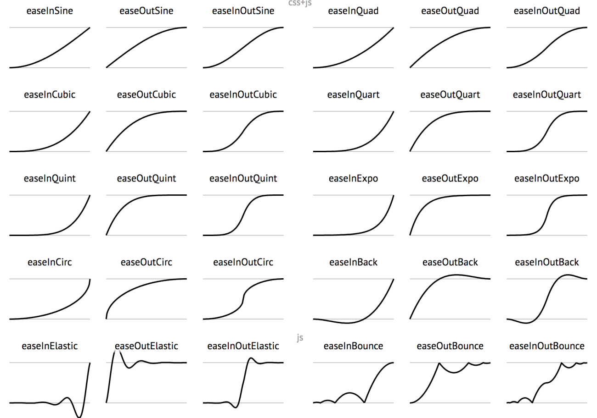

缓动函数有两种表示方式：

1. x = f(t)，x 表示位移百分比，t 表示动效执行时间百分比
2. y = f(t, s, c, d)，y 表示欲变更位置，t 表示动效已执行时间，s 表示起始位置，c 表示总位移量，d 表示动效总时长

根据 x 与 t 的关系，缓动函数可以分为如下几类：

* 线性效果：即 x 与 t 成线性比例，速率 v 为恒定值
* 先加速后减速效果：即速率 v 先递增后递减
* 加速效果：即速率 v 递增，常见的是各类指数函数
* 减速效果：即速率 v 递减，常见的是各类指数函数的轴（y=x）对称函数

各类缓动函数名中，后缀 In 表示加速，Out 表示减速，InOut 标识先加速、后减速；后缀 Sine 表示由三角函数实现，Quad 表示由二次方函数实现，Cubic 为三次方，Quart 为四次方，Quint 为五次方，Circ 为开平方根，Expo 为开立方根，Elastic 为结合三角函数和开立方根的初级弹簧效果，Back 为使用常数 1.70158 计算的回退效果，Bounce 为高级弹簧效果。linear 为线性函数。

下图即为缓动函数速查表：

以下图示基于 [function-plot](https://mauriciopoppe.github.io/function-plot) 制作。

## linear 线性效果

<code src="./linear/index.tsx" />

## swing 先加速后减速

<code src="./swing/index.tsx" />

## easeIn 加速效果

easeIn 从 0 开始加速效果。

* easeInSine: 使用正弦函数制作的加速缓动函数
* easeInQuad: 使用二次方函数制作的加速缓动函数
* easeInCubic: 使用三次方函数制作的加速缓动函数
* easeInQuart: 使用四次方函数制作的加速缓动函数
* easeInQuint: 使用五次方函数制作的加速缓动函数
* easeInCirc: 使用平方根函数（实际为圆形曲线）制作的加速缓动函数
* easeInEppo: 使用立方根函数制作的加速缓动函数
* easeInElastic: 使用三角函数和立方根函数制作的初级弹簧效果
* easeInBack: 使用常数 1.70158 计算的回退效果
* easeInBounce: 高级弹簧效果

<code src="./easein/index.tsx" />

## easeOut 减速效果

easeOut 减速到 0 效果。

* easeOutSine: 使用正弦函数制作的减速缓动函数
* easeOutQuad: 使用二次方函数制作的减速缓动函数
* easeOutCubic: 使用三次方函数制作的减速缓动函数
* easeOutQuart: 使用四次方函数制作的减速缓动函数
* easeOutQuint: 使用五次方函数制作的减速缓动函数
* easeOutCirc: 使用平方根函数（实际为圆形曲线）制作的减速缓动函数
* easeOutEppo: 使用立方根函数制作的减速缓动函数
* easeOutElastic: 使用三角函数和立方根函数制作的初级弹簧效果
* easeOutBack: 使用常数 1.70158 计算的回退效果
* easeOutBounce: 高级弹簧效果

<code src="./easeout/index.tsx" />

## easeInOut 先加速后减速

easeInOut 前半段从 0 开始加速，后半段减速到 0 效果。

* easeInOutSine: 使用正弦函数制作的先加速后减速缓动函数
* easeInOutQuad: 使用二次方函数制作的先加速后减速缓动函数
* easeInOutCubic: 使用三次方函数制作的先加速后减速缓动函数
* easeInOutQuart: 使用四次方函数制作的先加速后减速缓动函数
* easeInOutQuint: 使用五次方函数制作的先加速后减速缓动函数
* easeInOutCirc: 使用平方根函数（实际为圆形曲线）制作的先加速后减速缓动函数
* easeInOutEppo: 使用立方根函数制作的先加速后减速缓动函数
* easeInOutElastic: 使用三角函数和立方根函数制作的初级弹簧效果
* easeInOutBack: 使用常数 1.70158 计算的回退效果
* easeInOutBounce: 高级弹簧效果

<code src="./easeinout/index.tsx" />

## 参考

[缓动公式小析](http://blog.cgsdream.org/2015/09/19/tweenslow-motion-formula/)